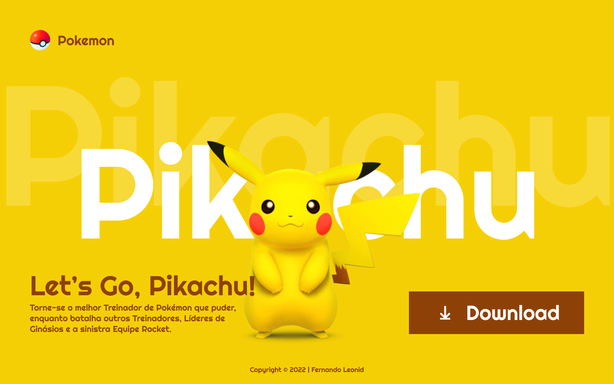

# landing-page-pikachu

---
## Sobre
Site do tipo landing-page para divulgar o jogo Let's go Pikachu!
O objetivo do projeto é colocar em prática os conteúdos que foram apresentados no curso de [SENAI JANDIRA](https://jandira.sp.senai.br/).
[Clique aqui para acessar o site](https://andreluisconstantino.github.io/landing-page-pikachu/)

---
## Tecnologias Utilizadas
- HTML5
- CSS3
- Responsividade
- Markdown

---
## Autor
- [André Luiz Constantino](https://github.com/AndreLuisConstantino)